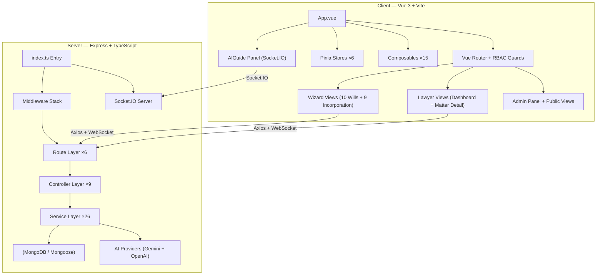

# Valiant Law Client Portal

> **Secure Legal Intake System** — A secure portal to submit clients' information to the Valiant Law legal team, augmented with AI-powered guidance and automated risk flagging.

## 📋 Overview

The Valiant Law Client Portal is a full-stack Vue.js and Node.js web application that streamlines the legal intake and document preparation process. It provides a secure, guided experience for clients while automating triage and document generation for the legal team.

### Primary Workflow

1. **Intake**: Client completes the secure intake form with real-time AI assistance.
2. **Review & Preparation**: Valiant Law team reviews the client's submission with AI-generated risk flags, priority scores, summaries, and clause suggestions — and prepares the client's documents.
3. **Finalization**: A Valiant Law lawyer contacts the client to confirm and finalize the details.

### Key Features

- **Progressive Disclosure Wizard** — 10-step wills intake + 9-step business incorporation, with dynamic branching and strategy-pattern validation.
- **Dual AI Provider** — Google Gemini and OpenAI support with admin hot-swap, streaming (WebSocket → SSE → REST fallback), and deterministic offline fallbacks.
- **Deterministic Rules Engines** — Automatic hard/soft flag generation and cross-section logic consistency checks for both wills and incorporation — runs independently of AI.
- **Proactive AI Guide** — 25 declarative rules (17 wills + 8 incorporation) evaluate per wizard step, injecting contextual tips/warnings into the AI chat panel with staggered reveal delays.
- **Prompt Injection Defense** — Multi-layer sanitisation: allowlisted enumerations, 20+ regex patterns, XML delimiter escaping, control character removal, and forensic audit logging.
- **Lawyer Console** — Review intakes, add notes, send nudge emails, manage dispositions via RBAC-protected dashboards with real-time Socket.IO updates.
- **DOCX Export** — One-click standardised legal document generation (Client Summary Memo + Draft Will / Incorporation documents).
- **People Directory** — Define a person once, deduplicate intelligently, and reuse across profile, family, executor, and beneficiary sections.
- **Optimistic Concurrency Control** — Version-checked updates prevent multi-tab/device silent overwrites.
- **Graceful Shutdown** — SIGTERM handler drains HTTP connections, closes WebSocket, disconnects MongoDB with 10s force-exit timeout for Cloud Run scale-down.

---

## 🏗️ Architecture



### Folder Structure
```
will_guide/
├── client/               # Vue 3 + Vite Frontend
│   ├── src/
│   │   ├── components/   # Reusable UI (AIGuide, PeoplePicker, QuestionHelper, CaseNotes)
│   │   ├── composables/  # 15 Vue 3 composition functions (validation, AI hooks, proactive guide, steps)
│   │   ├── router/       # Vue Router with RBAC navigation guards
│   │   ├── stores/       # 6 Pinia stores (auth, intake, aiChat, triage, incorpIntake, incorpTypes)
│   │   ├── services/     # Client-side service layer
│   │   ├── types/        # TypeScript interfaces
│   │   ├── utils/        # Utility functions (auth storage, etc.)
│   │   └── views/        # 14 page views + wizard/ (10 steps) + incorporation/ (9 steps)
│   └── package.json
│
├── server/               # Node.js + Express Backend
│   ├── src/
│   │   ├── controllers/  # 9 request handlers (auth, intake, lawyer, admin, AI, incorporation, etc.)
│   │   ├── middleware/    # auth (JWT), CSRF, rate limiting, request logging, Zod validation
│   │   ├── models/       # 7 Mongoose schemas (User, Intake, RefreshToken, PasswordResetToken, AiUsageLog, AuditLog, SystemSetting)
│   │   ├── routes/       # 6 Express route groups
│   │   ├── schemas/      # Zod validation schemas (intake, incorporation)
│   │   ├── services/     # 26 services (10 AI modules, 2 rules engines, 2 DOCX generators, email, etc.)
│   │   ├── types/        # TypeScript interfaces & DTOs
│   │   ├── errors/       # Structured AppError hierarchy
│   │   ├── config/       # JWT configuration
│   │   ├── utils/        # Index sync, helpers
│   │   └── index.ts      # Entry point (Express + Socket.IO server)
│   └── package.json
│
├── e2e/                  # 16 Playwright E2E test specs
├── .env / .env.example   # Environment configuration
├── Dockerfile            # Multi-stage production build
└── playwright.config.ts  # E2E test configuration
```

---

## 🛠️ Technology Stack

### Frontend
| Technology | Version | Purpose |
|---|---|---|
| Vue.js | 3.4 | Reactive UI framework |
| Vite | 5.0 | Build tool & dev server |
| Pinia | 2.1 | State management (6 stores) |
| Vue Router | 4.2 | Client-side routing with RBAC guards |
| Tailwind CSS | 3.4 | Utility-first styling |
| TypeScript | 5.3 | Type safety |
| Socket.IO Client | 4.8 | Real-time AI streaming & push notifications |
| Axios | 1.6 | HTTP client |
| Marked | 17.0 | Markdown rendering for AI responses |
| DOMPurify | 3.3 | XSS sanitisation for rendered content |
| Vitest | 1.6 | Unit testing (+ Vue Test Utils) |

### Backend
| Technology | Version | Purpose |
|---|---|---|
| Node.js | 20+ | JavaScript runtime |
| Express | 4.18 | HTTP framework |
| MongoDB | 8.0 | Document database |
| Mongoose | 8.0 | MongoDB ODM with index sync |
| Zod | 4.3 | Dual-layer validation (API + pre-save hooks) |
| JWT | 9.0 | Authentication via HTTP-only cookies + Bearer header |
| Socket.IO | 4.8 | Real-time WebSocket server |
| Google Generative AI | 0.24 | Gemini API (3.1 Flash Lite / 2.5 Flash / 1.5 Flash) |
| OpenAI (REST) | — | GPT-4.1 Mini / GPT-4o Mini / GPT-5 Mini |
| Helmet | 7.1 | Security headers |
| docx | 9.5 | DOCX document generation |
| Pino | 10.3 | Structured JSON logging |
| Multer | 2.0 | File upload handling (asset import) |
| SendGrid | 8.1 | Email delivery (nudge reminders) |
| Swagger | 6.2 | API documentation (dev only) |
| Jest | 30.2 | Unit testing (+ Supertest for APIs) |
| Playwright | 1.44 | End-to-end testing |

---

## 🚀 Getting Started

### Prerequisites

- Node.js 20+
- MongoDB (local or Atlas)
- Google Gemini API key and/or OpenAI API key
- (Optional) Docker for containerised deployment

### Installation

1. **Clone the repository**
   ```bash
   git clone <repo-url>
   cd will_guide
   ```

2. **Configure environment**
   ```bash
   # Copy the example and edit with your values
   cp .env.example .env

   # Required keys:
   MONGODB_URI=mongodb://localhost:27017/willguide
   JWT_SECRET=your_strong_secret_key
   GEMINI_API_KEY=your_gemini_api_key      # AI features degrade gracefully without it
   ```

3. **Install dependencies**
   ```bash
   # Using npm workspaces from root
   npm install
   ```

4. **Start development servers**
   ```bash
   # Terminal 1 - Backend (port 3000)
   cd server && npm run dev

   # Terminal 2 - Frontend (port 5173)
   cd client && npm run dev
   ```

5. **Open in browser**
   ```
   http://localhost:5173
   ```

---

## 📡 API Endpoints & Data Validation

### Dual Validation Model
1. **API Layer**: `validateBody()` middleware intercepts requests and runs Zod schemas.
2. **Database Layer**: Mongoose `pre('save')` hooks run Zod schemas (`IntakeDataSchema` / `IncorporationDataSchema`) before persisting — ensuring integrity even if controllers are bypassed.

### Key Routes

| Method | Endpoint | Auth | Description |
|---|---|---|---|
| POST | `/api/auth/login` | No | Authenticate user & issue JWT (HTTP-only cookies) |
| POST | `/api/auth/register` | No | Register new client account |
| POST | `/api/auth/forgot-password` | No | Initiate password reset flow |
| GET | `/api/intake/current` | Client | Resume latest intake |
| POST | `/api/intake` | Client | Create or resume intake |
| PUT | `/api/intake/:id` | Client | Update intake (OCC version check, auto-runs rules & flags) |
| POST | `/api/intake/:id/submit` | Client | Final submission with full rules + AI processing |
| POST | `/api/intake/chat` | Client | Multi-turn contextual AI chat |
| POST | `/api/intake/:id/stress-test` | Client | AI logic stress testing against current step |
| POST | `/api/intake/:id/validate-logic` | Client | AI logic validation per wizard step |
| POST | `/api/intake/:id/legal-phrasing` | Client | AI legal terminology conversion |
| POST | `/api/intake/:id/assets/import` | Client | Multimodal AI import for asset text/documents |
| POST | `/api/intake/:id/explain-risk` | Any | AI risk flag explanation |
| GET | `/api/intake/:id/insight` | Client | AI "next best action" for dashboard |
| GET | `/api/intake/:id/summary` | Client | AI natural-language estate plan summary |
| GET | `/api/intake/:id/doc` | Client/Lawyer | Generate & download DOCX summary/draft |
| GET | `/api/lawyer/intakes` | Lawyer/Admin | List all intakes for review dashboard |
| GET | `/api/lawyer/intake/:id/suggestions` | Lawyer/Admin | AI clause suggestions for matter |
| POST | `/api/lawyer/intake/:id/nudge` | Lawyer/Admin | Send email reminder (24h throttle) |
| POST | `/api/lawyer/intake/:id/notes` | Lawyer/Admin | Add case notes |
| POST | `/api/lawyer/copilot/chat` | Lawyer/Admin | Lawyer AI copilot for intake review |
| GET | `/api/admin/users` | Admin | User management |
| GET | `/api/admin/ai/settings` | Admin | View/update AI provider, model, operational params |
| PUT | `/api/admin/ai/settings` | Admin | Hot-swap AI provider/model without restart |

### Real-Time Events (Socket.IO)

| Room | Members | Event | Payload |
|---|---|---|---|
| `lawyer_updates` | Lawyers + Admins | `intake_updated` | Intake list DTO |
| `client_{userId}` | Individual client | `intake_status_changed` | `{ intakeId, status }` |
| (direct) | Any authenticated | `ai:chat` → `ai:chunk` → `ai:done` | Streaming AI response |

---

## 🧙 Wizard Flow & Validation Strategy

### Wills Wizard (10 Steps)

The intake consists of 10 progressive sections validated client-side via a **Strategy Pattern** (`useIntakeValidation.ts`) with dynamic step routing (`useIntakeSteps.ts`):

1. **Personal Profile** — Identity, contact, marital status
2. **Family** — Spouse, children, dependants with age tracking
3. **Guardians** — Dynamically required only if minor children exist
4. **Executors** — Primary and alternates with relationship tracking
5. **Beneficiaries** — Total shares strictly enforced to 100%
6. **Assets** — Multi-category list (real estate, bank accounts, investments, business, vehicles, digital, foreign, other) with AI smart import
7. **Power of Attorney** — Property and Personal Care attorneys
8. **Funeral** — Burial/cremation preferences
9. **Prior Wills** — Existing documents & foreign will detection
10. **Review** — Full summary, AI estate summary, and submission

### Incorporation Wizard (9 Steps)

Parallel OBCA/CBCA business incorporation intake:

1. **Jurisdiction & Name** — OBCA vs CBCA, NUANS search
2. **Structure & Ownership** — Share classes, directors, shareholders
3. **Articles of Incorporation** — Filing details
4. **Post-Incorporation Organisation** — Organisational resolutions
5. **Share Issuance** — Initial share distribution
6. **Corporate Records** — Minute book, ISC register
7. **Registrations** — CRA, HST/GST, payroll, WSIB
8. **Banking & Compliance** — Bank setup, fiscal year
9. **Review** — Summary and submission

---

## 🚨 Deterministic Rules Engines

Instead of relying on AI for critical escalation logic, the portal uses deterministic rules engines (`rulesEngine.ts` + `incorporationRulesEngine.ts`) that run on **every save**:

### Wills Rules Engine

#### Hard Flags (Mandatory Lawyer Review)
| Code | Trigger |
|---|---|
| `RESIDENCY_FAIL` | Client is not an Ontario resident |
| `MISSING_GUARDIAN` | Minor children detected but no guardians appointed |

#### Soft Flags (Attention Items)
| Code | Trigger |
|---|---|
| `SPOUSAL_OMISSION` | Married/common-law but spouse not listed as beneficiary (Family Law Act risk) |
| `FOREIGN_ASSETS` | Foreign assets detected (potential multiple wills needed) |
| `BUSINESS_ASSETS` | Business assets present (consider Secondary Will / Corporate Executor) |

#### Logic Cross-Checks
| Code | Trigger |
|---|---|
| `POSSIBLE_DISINHERITANCE` | Child(ren) in Family but absent from Beneficiaries |
| `EXECUTOR_CAPABILITY` | Business assets + spouse as Primary Executor |

### Incorporation Rules Engine

#### Hard Flags
| Code | Trigger |
|---|---|
| `CBCA_DIRECTOR_RESIDENCY` | CBCA requires at least 1 resident Canadian director when fewer than 4 directors |
| `DIRECTOR_RESIDENCY_FAIL` | Less than 25% of CBCA directors are resident Canadians |
| `NUANS_MISSING` | Named corporation without a NUANS report |
| `NUANS_EXPIRED` | NUANS report older than 90 days |
| `OBCA_OFFICE_NOT_ONTARIO` | OBCA corporation registered office not in Ontario |
| `LEGAL_ENDING_MISSING` | Named corporation missing legal ending (Ltd., Inc., Corp., etc.) |

#### Soft Flags
| Code | Trigger |
|---|---|
| `USA_NOT_CONSIDERED` | Multi-shareholder corp without Unanimous Shareholders' Agreement consideration |
| `S85_NOT_ASSESSED` | Property as consideration without s.85 ITA rollover assessment |
| `ISC_REGISTER_MISSING` | Register of Individuals with Significant Control not established |
| `EXTRA_PROVINCIAL_REMINDER` | CBCA corporation without extra-provincial registration |
| `FISCAL_YEAR_NOT_SET` | No fiscal year-end determined |

#### Logic Cross-Checks
| Code | Trigger |
|---|---|
| `SHARE_CLASS_MISMATCH` | Shareholder references undefined share class |
| `DIRECTOR_COUNT_MISMATCH` | Listed directors ≠ Articles fixed count |
| `DIRECTOR_COUNT_OUT_OF_RANGE` | Listed directors outside Articles min–max range |
| `SUBSCRIPTION_SHAREHOLDER_MISMATCH` | Subscription agreement count ≠ shareholder count |

---

## 🤖 AI Integration Architecture

The AI layer is split into **10 modules** behind a barrel export (`aiService.ts`), with **dual-provider support** (Google Gemini + OpenAI) and admin-configurable runtime settings.

### AI Modules

| Module | Purpose |
|---|---|
| `aiClient.ts` | Dual-provider abstraction (Gemini SDK + OpenAI REST), token-bucket rate limiter, retry with backoff |
| `aiChatService.ts` | Multi-turn chat + WebSocket streaming, two system prompts (wills + incorporation) |
| `aiAnalysisService.ts` | Logic validation, stress testing, risk explanation, clause suggestions |
| `aiParserService.ts` | Asset extraction (text + vision/multimodal) with JSON mode |
| `aiScoringService.ts` | Deterministic priority scoring (0–100) + auto-note generation for data changes |
| `aiContextSummariser.ts` | Context scoping — reduces token usage by 60–80% per call |
| `aiSanitiser.ts` | Prompt injection defense (20+ patterns, XML escape, allowlists, audit logging) |
| `aiCacheService.ts` | In-memory TTL cache with SHA-256 hash keys |
| `aiSettingsService.ts` | Runtime-configurable provider, model, rate limit, retries, cache TTL — persisted to MongoDB |
| `aiUsageTracker.ts` | Async usage telemetry (token counts, latency, model, step) to `AiUsageLog` collection |

### Core AI Capabilities
- ✅ **Proactive Guidance**: Explains questions in plain language based on the exact wizard step
- ✅ **Smart Asset Parsing**: Uses JSON mode and Vision to extract `{description, value, ownership}` from text or uploaded documents
- ✅ **Legal Stress-Testing**: Context-scoped logical review (e.g. checks executors for age/conflicts, limits to max 3 critical questions)
- ✅ **Risk Explanation**: Converts raw rule-engine flags (e.g. `SPOUSAL_OMISSION`) into empathetic, client-facing legal explanations
- ✅ **Clause Suggestions**: Pre-computes standard will clauses based on client asset profiles
- ✅ **Estate Summary**: AI-generated natural-language plan preview for client review
- ✅ **Dashboard Insight**: AI "next best action" guidance on the client dashboard
- ✅ **Legal Phrasing**: Converts informal text into proper Ontario legal terminology
- ✅ **Lawyer Copilot**: AI assistant for lawyers reviewing intake data

### Architectural Safeguards
- **Deterministic Fallbacks**: Every AI function returns meaningful static responses if the API key is missing or the API fails
- **Context Scoping**: `scopeToStep()` and `scopeToFlag()` send only relevant sections to the AI — not the full intake
- **Prompt Injection Defense**: Multi-layer sanitisation with forensic audit trail
- **Rate Limiting**: Token-bucket per-minute limiter with configurable ceiling
- **Usage Tracking**: Every AI call logs token counts, latency, model, and step to `AiUsageLog`
- **XML-Tag Separation**: User messages always wrapped in `<user_message>` tags to prevent instruction override

---

## 🔒 Security Model

- **Authentication**: JWT tokens delivered via HTTP-only cookies (primary) + Bearer header (fallback). 10-round bcrypt password hashes. `passwordHash` excluded from queries by default via Mongoose `select: false`.
- **Account Lockout**: Failed login attempt tracking with `lockedUntil` timestamp.
- **Authorization**: `authenticate` → `requireRole()` → `requireOwnership()` middleware chain. Three roles: `client`, `lawyer`, `admin`.
- **CSRF Protection**: Double-submit cookie pattern via `csrfMiddleware.ts`.
- **Rate Limiting**: Separate `express-rate-limit` arrays for global API, strict auth endpoints, and AI routes.
- **Ownership Verification**: Resource-level access control prevents horizontal privilege escalation (admin bypass).
- **Transport Security**: `helmet()` for HTTP headers, strict CORS origins, `trust proxy` for Cloud Run.
- **Client-Side Guards**: UX-only navigation guards in Vue Router — true authorisation is enforced server-side.
- **AI Security**: Prompt injection defense, input sanitisation, allowlisted step/flag enumerations.

---

## 🧪 Testing

### Test Infrastructure

| Layer | Framework | Specs |
|---|---|---|
| Server unit/integration | Jest 30.2 + Supertest 7.2 | `server/src/tests/` |
| Client unit | Vitest 1.6 + Vue Test Utils 2.4 | `client/src/tests/` |
| E2E | Playwright 1.44 | 16 spec files in `e2e/` |

### E2E Test Coverage

| Spec | Scenario |
|---|---|
| `auth.spec.ts` | Login and session management |
| `registration.spec.ts` | Client registration flow |
| `password-reset.spec.ts` | Forgot/reset password flow |
| `home.spec.ts` | Landing page and navigation |
| `will-intake.spec.ts` | Basic wills wizard flow |
| `will-wizard-steps.spec.ts` | Individual wizard step validation |
| `wizard-branching.spec.ts` | Dynamic step inclusion/exclusion |
| `full-submission-flow.spec.ts` | End-to-end submission with rules engine |
| `incorp-wizard.spec.ts` | Incorporation wizard flow |
| `lawyer-review.spec.ts` | Lawyer dashboard review workflow |
| `matter-detail.spec.ts` | Matter detail view and actions |
| `admin-panel.spec.ts` | Admin panel and user management |
| `ai-chat.spec.ts` | AI chat widget interactions |
| `nudge-email.spec.ts` | Email reminder with throttle |
| `visual-regression.spec.ts` | Visual regression snapshot tests |
| `test-50-complex.spec.ts` | Comprehensive complex scenarios (49 KB) |

### Running Tests

```bash
# Server tests (Jest + Supertest)
cd server && npm test

# Client tests (Vitest + Vue Test Utils)
cd client && npm test

# E2E tests (Playwright)
npm run e2e

# E2E with browser visible
npm run e2e:headed

# View E2E report
npm run e2e:report
```

---

## ⚙️ Environment Variables

Copy `.env.example` to `.env` and configure:

| Variable | Required | Default | Description |
|---|---|---|---|
| `MONGODB_URI` | Yes | `mongodb://localhost:27017/willguide` | MongoDB connection string |
| `JWT_SECRET` | Yes | — | Secret for JWT signing |
| `GEMINI_API_KEY` | No* | — | Google Gemini API key |
| `GEMINI_MODEL` | No | `gemini-3.1-flash-lite-preview` | Gemini model name |
| `OPENAI_API_KEY` | No* | — | OpenAI API key |
| `OPENAI_MODEL` | No | `gpt-4.1-mini` | OpenAI model name |
| `AI_PROVIDER` | No | `gemini` | Active AI provider (`gemini` or `openai`) |
| `AI_RATE_LIMIT` | No | `30` | Max AI requests per minute |
| `AI_MAX_RETRIES` | No | `3` | Max retry attempts per AI call |
| `AI_CACHE_TTL` | No | `3600` | Cache TTL in seconds |
| `CORS_ORIGIN` | No | `http://localhost:5173` | Frontend URL for CORS |
| `PORT` | No | `3000` | Server port |
| `NODE_ENV` | No | `development` | Environment mode |
| `LOG_LEVEL` | No | `info` | Pino log level |

> \* At least one AI API key is recommended. AI features degrade gracefully without keys — all AI functions return deterministic fallback responses.

---

## 🚢 Deployment

- **Platform**: GCP Cloud Run (serverless containers)
- **CI/CD**: GitHub Actions → Cloud Build → Artifact Registry → Cloud Run
- **Docker**: Multi-stage build — Vite builds Vue SPA to static files, copied into server's `public/` directory
- **Production**: Express serves the Vue SPA with SPA fallback routing

```bash
# Build for production
cd client && npm run build
cd server && npm run build

# Docker build
docker build -t valiant-law-portal .
```

---

## 🎯 Scope

### Included (Current)
- Ontario wills intake questionnaire (10-step wizard)
- OBCA/CBCA business incorporation intake (9-step wizard)
- Dual AI provider support (Gemini + OpenAI) with admin hot-swap
- Deterministic rules engines with cross-section logic checks
- Lawyer review console with AI copilot, case notes, and nudge emails
- DOCX output generation (Client Summary Memo + Draft Will)
- Real-time Socket.IO updates (lawyer dashboard + client status push)
- Comprehensive RBAC with JWT auth, CSRF, rate limiting
- AI prompt injection defense with forensic audit trail
- Swagger API documentation (dev only)

### Not Included (Phase 2+)
- Finalised will document generation (currently generates Draft Will)
- Multi-province/International support
- Deep tax/probate optimisation
- E-signatures / ID verification
- Payment processing / Clio integrations
- Multi-language (i18n)
- Redis-backed AI cache (currently in-memory)

---

## 📄 License

Proprietary — All rights reserved.

---

## 👥 Contributors

- Synergy IT Solutions Group Inc.
